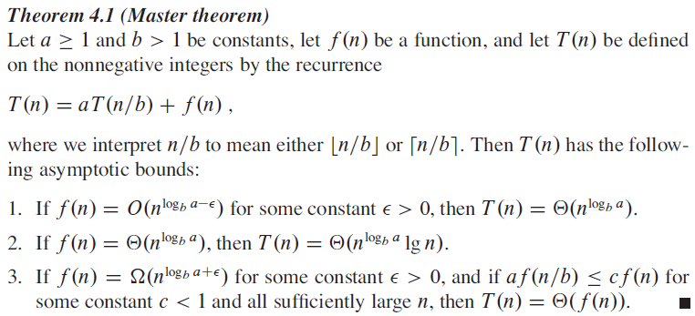

# Exercises for Lecture 1: Divide and Conquer

## Exercise 1

Use the master method to determine the running time of

* FIND-MAXIMUM-SUBARRAY
* MERGE-SORT
* SQUARE-MATRIX-MULTIPLY-RECURSIVE
* Strassen's Algorithm

### FIND-MAXIMUM-SUBARRAY

$$
T(n) = \begin{cases}
\Theta(1) &\text{ if } n=1\\
2T(n/2)+\Theta(n) &\text{ if } n>1
\end{cases}
$$

### MERGE-SORT

$$
T(n) = \begin{cases}
\Theta(1) &\text{ if } n=1\\
2T(n/2)+\Theta(n) &\text{ if } n>1
\end{cases}
$$

### SQUARE-MATRIX-MULTIPLY-RECURSIVE

$$
T(n) = \begin{cases}
\Theta(1) &\text{ if } n=1\\
8T(n/2)+\Theta(n^2) &\text{ if } n>1
\end{cases}
$$

### Strassen's Algorithm

$$
T(n) = \begin{cases}
\Theta(1) &\text{ if } n=1\\
7T(n/2)+\Theta(n^2) &\text{ if } n>1
\end{cases}
$$

### FIND-MAXIMUM-SUBARRAY Solution

$a=2, b=2, f(n)=n$

$$
n^{\log_ba}=n^{\log_22}=n^1=n
$$

We compare $f(n)$ to $n^{\log_ba}$

$$
n = n
$$

As such, the running time of FIND-MAXIMUM-SUBARRAY is
$$
T(n)=\Theta(n^{\log_ba}\lg n)=\Theta(f(n)\lg n)=\Theta(n\lg n)
$$

### MERGE-SORT Solution

As the reccurrence for MERGE-SORT is the same as for FIND-MAXIMUM-SUBARRAY, their running time will be equal, and as such, the running time of MERGE-SORT is:
$$
T(n)=\Theta(n\lg n)
$$

### SQUARE-MATRIX-MULTIPLY-RECURSIVE Solution
$a=8, b=2, f(n)=n^2$

$$
n^{\log_ba}=n^{\log_28}=n^3
$$

We compare $f(n)$ to $n^{\log_ba}$
$$
n^2 < n^3
$$

We see that $n^{\log_ba-\epsilon} = f(n)$, where $\epsilon=1$

As such, the running time of SQUARE-MATRIX-MULTIPLY-RECURSIVE is:
$$
T(n)=\Theta(n^3)
$$

### Strassen's Algorithm Solution
$a=7, b=2, f(n)=n^2$

$$
n^{\log_ba}=n^{\log_27}
$$

We compare $f(n)$ to $n^{\log_ba}$
$$
n^2 < n^{\log_27}
$$

As $n^{\log_27}$ is greater than $n^2$, the running time of Strassen's Algorithm becomes:
$$
T(n)=n^{\lg7}
$$

## Exercise 2

Use the master method to give tight asymptotic bounds for the following recurrences

1. $T(n)=2T(n/4)+1$
2. $T(n)=2T(n/4)+\sqrt{n}$
3. $T(n)=2T(n/4)+n$
4. $T(n)=2T(n/4)+n^2$

### Solution

For all cases $a=2, b=4$

$$
n^{\log_ba} = n^{\log_42} = n^{0.5} = \sqrt{n}
$$

#### 1.

$f(n)=1$

Since $n^{0.5} > 1$:
$$
T(n)=\Theta(\sqrt{n})
$$

#### 2.

$f(n) = \sqrt{n}$

As $\sqrt{n} = \sqrt{n}$:
$$
T(n)=\Theta(\sqrt{n}\lg n)
$$

#### 3.

$f(n) = n$

$n^{0.5} < n^1$

We see that $n^{\log_ba+\epsilon} = f(n)$, where $\epsilon=0.5$

We now check the "regularity" condition:
$$
2f(n/4)\le cf(n) \rightarrow 2*n/4 \le cf(n) \rightarrow \frac{n}{2}\le cf(n)
$$
So, for $c \ge \frac{1}{2}$, the running time becomes:
$$
T(n)=\Theta(n)
$$

#### 4.

$f(n) = n^2$

$n^{0.5} < n^2$

Regularity:
$$
2*(n/4)^2\le cf(n^2) \rightarrow \frac{2*n^2}{32} \le cf(n^2) \rightarrow \frac{n^2}{16} \le cf(n^2)
$$
As regularity holds for $c\ge\frac{1}{8}$, the running time becomes:
$$
T(n)=\Theta(n^2)
$$

## Exercise 3

Suppose you want to develop a matrix-multiplication algorithm that is asymptotically faster than Strassen’s algorithm. Your algorithm will divide each matrix into pieces of size $n/4 \times n/4$ and the divide and combine steps together will take $\Theta(n^2)$ time. What is the maximum number of subproblems your algorithm can create if it is to be faster than Strassen’s algorithm?

### Solution

