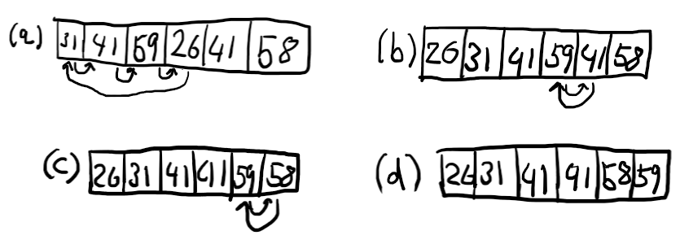

# Exercises for Lecture 1: Introduction to Algorithms
The following questions are taken from pages 22-23 of CLRS

## Exercises

### 2.1-1
Using Figure 2.2 as a model, illustrate the operation of INSERTION-SORT on the array $A = \langle31, 41, 59, 26, 41, 58\rangle$.

#### Answer



### 2.1-2
Rewrite the INSERTION-SORT procedure to sort into nonincreasing instead of non-decreasing order

```
for j = 2 to A.length
    key = A[j]
    // Insert A[j] into the sorted sequence A[1..j-1]
    i = j - 1
    while i > 0 and A[i] > key
        A[i+1] = A[i]
        i = i - 1
    A[i+1] = key
```

#### Answer
```
for j = 2 to A.length
    key = A[j]
    // Insert A[j] into the sorted sequence A[1..j-1]
    i = j - 1
    while i > 0 and A[i] < key
        A[i+1] = A[i]
        i = i - 1
    A[i+1] = key
```

### 2.1-3
Consider the **_searching problem_**:

**Input:** A sequence of _n_ numbers $A=\langle a_1, a_2, ..., a_n \rangle$.

**Output:** An index _i_ such that $v = A[i]$ or the special value NIL if _v_ does not appear in _A_.

Write pseudocode for **_linear search_**, which scans through the sequence, looking for _v_. Using a loop invariant, prove that your algorithm is correct. Make sure that your loop invariant fulfills the three necessary properties.

#### Answer
```
for i = 1 to A.length
    if v == A[i]
    return i
return NIL
```

### 2.1-4
Consider the problem of adding two _n_-bit binary integers, stored in two _n_-element arrays _A_ and _B_. The sum of the two integers should be stored in binary form in an ($n+1$)-element array _C_. State the problem formally and write pseudocode for adding the two integers.

#### Answer

**Input:** Two sequences of _n_ binary numbers $A=\langle a_1, a_2, ..., a_n \rangle$ and $B=\langle b_1, b_2, ..., b_n \rangle$.

**Output:** An ($n+1$) sequence of binary numbers _C_ which contains the sum of _A_ and _B_.

$A = \langle1, 1, 1\rangle$, $B=\langle 1, 1, 1\rangle$

$C = \langle1,1,1,0 \rangle$

```
ADD-BINARY(A, B)
    carry = 0
    int i = A.length + 1

    for i to 1
        C[i] = (A[i] + B[i] + carry) % 2
        carry = floor(s / 2)
        i -= 1

    C[1] = carry
    return C
```