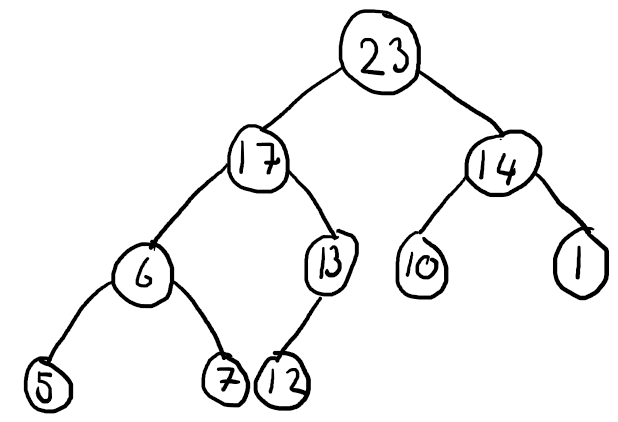
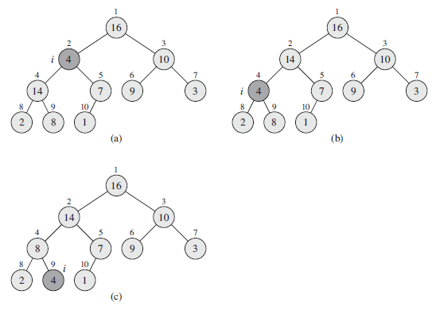
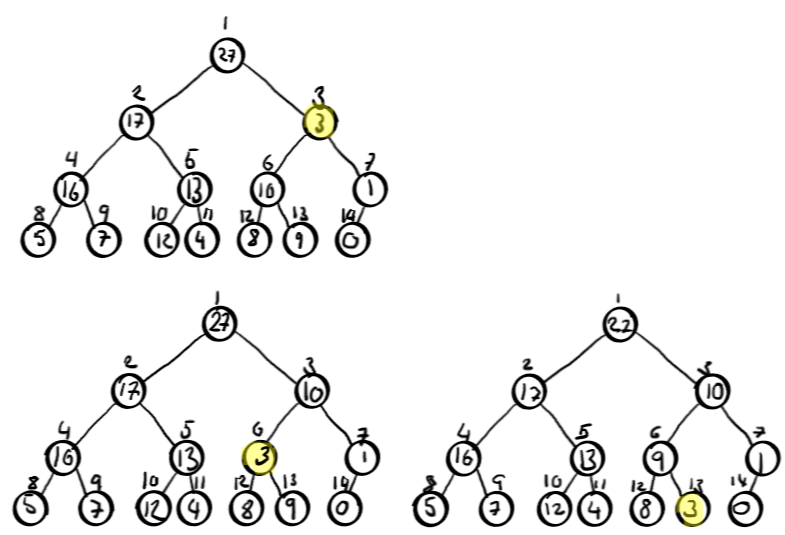

# Heaps, Heapsort and Priority Queues

## Exercises

### 6.1-1

What are the minimum and maximum numbers of elements in a heap of height _h_?

#### Solution

Minimum:
$$
2^0 + 2^1 + 2^2 + ... + 2^{h-1} + 1 = 2^h
$$

Maximum:
$$
2^0 + 2^1 + 2^2 + ... + 2^h = 2^{h+1} - 1
$$

### 6.1-2

Show than an _n_-element heap has height $\lfloor\lg n\rfloor$

#### Solution

By using the above formulas, we can use the minimum and maximum amount of elements to prove this

Assuming a heap of $n=6$ elements, we calculate the supposed height and see if it is in the range of the minimum and maximum amount of elements:
$$
\lfloor\lg6\rfloor=\lfloor2.584\rfloor=2
$$

We test the hypothesis that the height of a 6 element heap is 2:
Minimum:
$$
2^2 = 4
$$

Maximum:
$$
2^3-1=7
$$

It turns out to be true

### 6.1-3

Show that in any subtree of a max-heap, the root of the subtree contains the largest value occuring anywhere in that subtree

#### Solution

The max-heap property dictates: every node is less than or equal to its parent.

Therefore, no matter where we make a subtree, the highest node (the root) will have the largest value, as its childrens values are lesser, and their childrens values are lesser, and so on.

### 6.1-4

Where in a max-heap might the smallest element reside, assuming that all elements are distinct?

#### Solution

The smallest element in a max-heap will always reside in the last position, as the array will be continuously decreasing

### 6.1-5

Is an array that is in sorted order a min-heap?

#### Solution

If it in non-decreasing order, it would be a min-heap. In non-increasing order, it would be a max-heap

### 6.1-6

Is the array with values $\langle23,17,14,6,13,10,1,5,7,12\rangle$ a max-heap?

#### Solution



The array is not a max-heap, as it is not sorted in a non-increasing order. Furthermore, 7 is a child of 6, which means the property does not hold

### 6.1-7

Show that, with the array representation for storing an _n_-element heap, the leaves are the nodes indexed by $\lfloor n/2\rfloor+1,\lfloor n/2\rfloor+2,...,n$

#### Solution

Since a heap is binary, half of its elements will be nodes, and in the array representation, nodes are always at the end, meaning that the leaves are indexed by
$$
\lfloor n/2\rfloor+1,\lfloor n/2\rfloor+2,...,n
$$

### 6.2-1

Using the figure below as a model, illustrate the operation of MAX-HEAPIFY(A,3) on the array $A = \langle 27,17,3,16,13,10,1,5,7,12,4,8,9,0 \rangle$


#### Solution



### 6.2-2

Starting with the procedure MAX-HEAPIFY, write psuedocode for the procedure MIN-HEAPIFY(A,i), which performs the corresponding manipulation on a min-heap. How does the running time of MIN-HEAPIFY compare to that of MAX-HEAPIFY?

```text
MAX-HEAPIFY(A,i)
    l = LEFT(i)
    r = RIGHT(i)
    if l <= A.heap-size and A[l] > A[i]
        largest = l
    else largest = i
    if r <= A.heap-size and A[r] > A[largest]
        largest = r
    if largest != i
        exchange A[i] with A[largest]
        MAX-HEAPIFY(A, largest)
```

#### Solution

```text
MIN-HEAPIFY(A,i)
    l = LEFT(i)
    r = RIGHT(i)
    if l <= A.heap-size and A[l] < A[i]
        least = l
    else least = i
    if r <= A.heap-size and A[r] < A[least]
        least = r
    if least != i
        exchange A[i] with A[least]
        MIN-HEAPIFY(A, least)
```

The running time is the same, as only some inequalities have been reversed.

### 6.2-3

What is the effect of calling MAX-HEAPIFY(A,i) when the element $A[i]$ is larger than its children?

#### Solution

Nothing. The algorithm terminates without exchanging any elements.

### 6.2-4

What is the effect of calling MAX-HEAPIFY(A,i) for $i>A.\text{heap-size}/2$?

#### Solution

Calling MAX-HEAPIFY on a node with index greather than half the heap, means you are calling it on a child. Once again, the algorithm would terminate without exchanging any elements.

### 6.2-5

The code for MAX-HEAPIFY is quite efficient in terms of constant factors, except possibly for the recursive call in line 10, which might cause some compilers to produce inefficient code. Write an efficient MAX-HEAPIFY that uses and iterative control construct (a loop) instead of recursion.

#### Solution

```text
MAX-HEAPIFY-ITERATIVE(A,i)
    for j = floor(lg(i)) to floor(lg(A.heap-size))
        l = LEFT(i)
        r = RIGHT(i)
        if l <= A.heap-size and A[l] > A[i]
            largest = l
        else largest = i
        if r <= A.heap-size and A[r] > A[largest]
            largest = r
        if largest != i
            exchange A[i] with A[largest]
            i = largest
            continue
        break
```

### 6.2-6

Show that the worst-case running time of MAX-HEAPIFY on a heap of size _n_ is $\Omega(\lg n)$. (Hint: For a heap with _n_ nodes, give node values that cause MAX-HEAPIFY to be called recursively at every node on a simple path from the root down to a leaf)

#### Solution

The reccurrence of MAX-HEAPIFY is $T(n)\le T(2n/3) + \Theta(1)$

Using the master theorem:
$a=1, b=\frac{2}{3}, f(n) = 1$

$$
n^{log_{\frac{2}{3}}1} = n^0 = 1
$$

Since $n^{log{b}a} = f(n)$, the running time becomes $\Theta(f(n)\lg n) = \Theta(1\lg n) = \Theta(\lg n)$.

Since $\Theta(\lg n)$ is a tight bound, MAX-HEAPIFY is, by definition both $O(\lg n)$ and $\Omega(\lg n)$