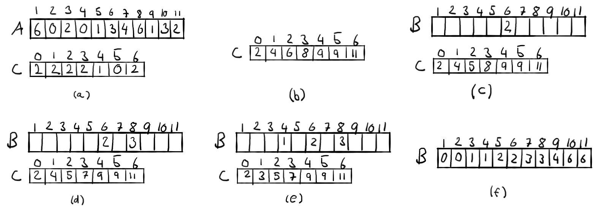

# Sorting in Linear Time Exercises

## 1

Using the following figure as a model, illustrate the operation of Counting-Sort on the array $A = \langle 6, 0, 2, 0, 1, 3, 4, 6, 1, 3, 2\rangle$.


### Solution



## 2

Using the figure below as an example, illustrate the operation of Radix-Sort on the following list of English words: COW, DOG, SEA, RUG, ROW, MOB, BOX, TAB, BAR, EAR, TAR, DIG, BIG, TEA, NOW, FOX.


### Solution


## 3

Which of the following sorting algorithms are stable: insertion sort, merge sort, heapsort, and quicksort? Give a simple scheme that makes any sorting algorithm stable. How much additional time and space does your scheme entail?

### Solution

INSERTION-SORT and MERGE-SORT are stable.
We must modify all key comparisons to also take position into account. This would be a constant-time process for each comparison, meaning it would add $\Theta(n)$ to the running time.

## 4

Use induction to prove that radix sort works. Where does your proof need the assumption that the intermediate sort is stable?

### Solution

```text
RADIX-SORT(A,d)
    for i = 1 to d
        use a stable sort to sort array A on digit i
```

For this we will use linear sort.

#### First iteration

$A = [6]$

```text
RADIX-SORT(A, 1)

returns A = [6]
```

#### Second iteration

$A = [62, 15]$

```text
RADIX-SORT(A, 2)

returns A = [15, 62]
```

#### Third iteration

$A = [627, 125, 434]$

```text
RADIX-SORT(A, 3)

returns A = [125, 434, 627]
```
