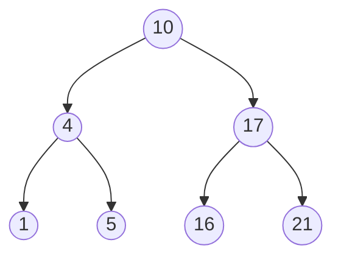
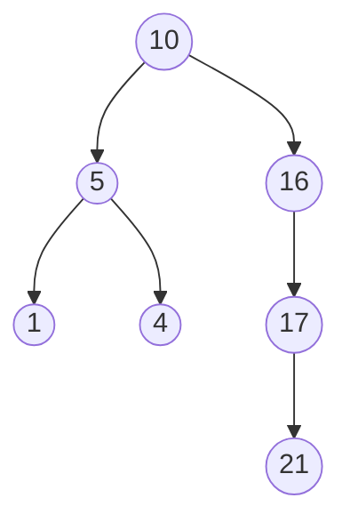
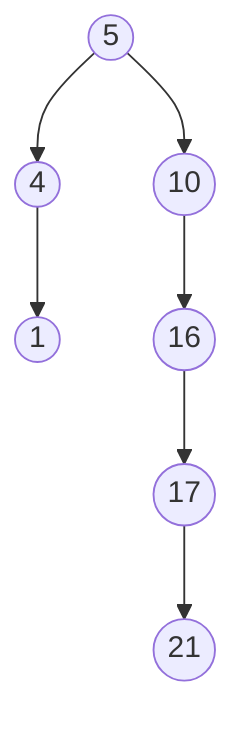
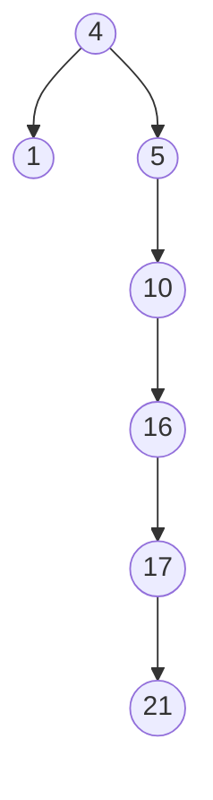
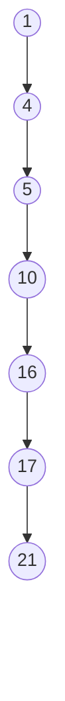

# Binary Search Trees Exercises

## 1

For the set of keys, $\{1, 4, 5, 10, 16, 17, 21\}$, draw binary search trees of heights $2, 3, 4, 5, \text{ and } 6$.

### Solution


---

---

---

---


## 2

What is the difference between the binary-search-tree property and the min-heap property? Can the min-heap property be used to print out the keys of an $n$-node tree in sorted order in $O(n)$ time? Show how, or explain why not.

### Solution

The binary-search-tree property ensures that the nodes in the left sub-tree are smaller, and the nodes in the right sub-tree are larger. In the min-heap property, every node is greater than, or equal to, its parent.

The min-heap property cannot be used to print out the keys of an $n$-node tree in sorted order, as you would have to HEAPIFY the tree before each print. This would add $O(\lg n)$ for each element in the tree, in the worst case.

## 3

Give a nonrecursive algorithm that performs an inorder tree walk. (Hint: An easy solution uses a stack as an auxiliary data structure. A more complicated, but elegant, solution uses no stack but assumes that we can test two pointers for equality.)

### Solution

```text
INORDER-TREE-WALK(T)
    let S be an empty stack
    current = T.root
    done = 0
    while !done
        if current != NIL
            PUSH(S, current)
            current = current.left
        else
            if !S.EMPTY()
                current = POP(S)
                print current
                current = current.right
            else done = 1        
```

## 4

Suppose that we have numbers between $1$ and $1000$ in a binary search tree, and we want to search for the number 363. Which of the following sequences could not be the sequence of nodes examined?
$$
2, 252, 401, 398, 330, 344, 397, 363
$$
$$
924, 220, 911, 244, 898, 258, 362, 363
$$
$$
925, 202, 911, 240, 912, 245, 363
$$
$$
2, 399, 387, 219, 266, 382, 381, 278, 363
$$
$$
935, 278, 347, 621, 299, 392, 358, 363
$$

### Solution

The third and fifth sequences are not possible.
The third because we take the left sub-tree of $911$ and later come across the number $912$, when all numbers at this point should be smaller than $911$.
The fourth because we take the right sub-tree of $347$ and later come across the number $299$, when all numbers at this point should be larger than $347$.

## 5

Write recursive versions of TREE-MINIMUM and TREE-MAXIMUM.

### Solution

```text
TREE-MINIMUM-RECURSIVE(x)
    if x.left != NIL
        return TREE-MINIMUM-RECURSIVE(x.left)
    else return x
```

```text
TREE-MAXIMUM-RECURSIVE(x)
    if x.right != NIL
        return TREE-MINIMUM-RECURSIVE(x.right)
    else return x
```

## 6

Write the TREE-PREDECESSOR prodecure.

### Solution

```text
TREE-PREDECESSOR(x)
    if x.left != NIL
        return TREE-MAXIMUM(x.left)
    y = x.p
    while y != NIL and x == y.left
        x = y
        y = y.p
    return y
```

# 7

We can sort a given set of $n$ numbers by first building a binary search tree containing these numbers (using TREE-INSERT repeatedly to insert the numbers one by one) and then printing the numbers by an inorder tree walk. What are the worst-case and best-case running times for this sorting algorithm?

### Solution

The best case happens when the numbers are not sorted at all, as TREE-INSERT has a running time of $O(h)$, and a non-sorted list of numbers would give the lowest height. As the height does not exceed $O(\lg n)$, the running time becomes $O(n\lg n)$.

The worst case happens when the numbers are sorted, as this will give the maximum height. The running time will be $O(n^2)$.

Inorder tree walk has the same running time in both cases.